<p align="center">
  
</p>

<p align="center">
  <a href="https://github.com/ishandutta2007/Awesome-Awesome-Awesome"></a><a href="https://discord.gg/jc4xtF58Ve"></a> <a href="https://github.com/ishandutta2007/Awesome-Cyber-Range-Platform/stargazers"></a> <a href="https://github.com/ishandutta2007/Awesome-Cyber-Range-Platform/network/members"></a> <a href="https://github.com/ishandutta2007/Awesome-Cyber-Range-Platform/blob/main/LICENSE"></a> <a href="https://github.com/ishandutta2007"></a>
</p>

# 🎯 Awesome Cyber Range Platform Ecosystem

> **A curated directory of top SaaS/hosted platforms, open-source cyber ranges, SOC simulators, red/blue team exercise environments, adversary emulation frameworks, and hands-on cyber readiness labs.**

[](#)
[](#-how-to-contribute)
[](https://github.com/ishandutta2007/Awesome-Awesome-Awesome)

---

## 📌 Overview

This repository is the definitive reference guide for **Cyber Range Platforms**, **Adversary Emulation Suites**, and **SOC Training Labs**. Modern cyber ranges provide high-fidelity, hands-on virtual environments for cybersecurity education, workforce development, incident response drills, threat hunting, CTFs, purple-teaming exercises, and automated security validation.

Whether you need an enterprise-grade hosted platform or want to construct an open-source, self-hosted, composable range using virtualization, infrastructure-as-code, and SIEM tooling, this curated ecosystem covers every component.

---

## 📑 Table of Contents

- [🏢 SaaS & Hosted Cyber Range Platforms](#-saas--hosted-cyber-range-platforms)
- [⚡ Open-Source Cyber Range & Simulation Projects](#-open-source-cyber-range--simulation-projects)
- [🧩 Recommended Open-Source Stacks](#-recommended-open-source-stacks)
- [🧱 Cyber Range Building Blocks](#-cyber-range-building-blocks)
- [📚 Essential Cyber Range Concepts & Terminology](#-essential-cyber-range-concepts--terminology)
- [⭐ Star History](#-star-history)
- [🤝 How to Contribute](#-how-to-contribute)
- [⚖️ Disclaimer](#-disclaimer)

---

## 🏢 SaaS & Hosted Cyber Range Platforms

The following enterprise and SaaS cyber range solutions provide managed cloud infrastructure, live-fire simulations, automated scoring, and curated workforce learning paths. *Ranked in descending order of company size (valuation / funding / revenue).*

| 🏷️ Platform | 📝 Description & Focus | 💼 Company Size (Valuation / Revenue) | 💰 Starting Pricing | 🎁 Free Tier / Trial Limits |
| :--- | :--- | :--- | :--- | :--- |
| **[Hack The Box Enterprise](https://www.hackthebox.com/business)** | Enterprise cybersecurity training and skills-development platform providing guided learning, dedicated labs, realistic environments, and team management. | **~$500M+ Valuation** ($73.7M funding raised; Carlyle-backed) | Starting at **$250/seat/month** ($2,500/seat/year billed annually, Build Tier) | **14-day Free Trial:** Up to 5 seats with access to Professional Labs, team management, and executive reporting features. |
| **[Hack The Box Academy for Business](https://academy.hackthebox.com/academy-for-business)** | Enterprise cybersecurity upskilling platform combining guided learning paths, interactive content, dedicated labs, and corporate training management. | **~$500M+ Valuation** ($73.7M funding raised; Carlyle-backed) | Starting at **$250/user/month** ($2,500/user/year, Build Tier; individual modules unlockable via Cubes starting from $8/bundle) | **14-day Free Business Trial;** Individual free tier includes permanent access to Tier 0 foundational modules and guided materials. |
| **[Immersive Labs](https://www.immersivelabs.com/)** | Cyber workforce resilience platform providing hands-on technical exercises, threat simulations, and role-based learning paths. | **~$300M+ Valuation** ($189M total funding raised) | Starting at **~$6,000–$10,000/year** (Core tier for small teams, min 5 users) | **Cyber Million Program:** 100% free access for individuals (aged 16+) to foundational defensive security learning pathways and entry-level labs. |
| **[Cyberbit](https://www.cyberbit.com/)** | Enterprise cyber-range and SOC training platform focused on realistic team-based cyber-defense exercises, incident response, and operational readiness. | **~$250M+ Valuation** (~$112M est. revenue, $122M+ total funding) | Starting at **~$7,200/year** (~$1,200–$1,500/user/year, typically 5-seat minimum) | **Cyberbit Free Edition:** Access to select foundational solo hands-on labs and theory modules; 1 live team exercise via PoC evaluation. |
| **[AttackIQ Academy](https://www.attackiq.com/)** | Security validation and adversary-emulation training ecosystem focused on MITRE ATT&CK, Purple Teaming, and Breach & Attack Simulation. | **~$150M–$200M Valuation** ($79M total funding raised) | **Free ($0)** (100% free community initiative sponsored by AttackIQ) | **Free Forever:** Unlimited access to all on-demand courses, hands-on lab environments, credentials, digital badges, and (ISC)² CPE credits. |
| **[SimSpace](https://www.simspace.com/)** | Enterprise cyber-range platform for realistic cyber exercises, cyber-defense training, network digital twins, and operational readiness. | **~$100M+ Valuation** ($45M total funding raised) | Starting at **~$25,000/year** (modular subscription based on range fidelity, user seats, and training scenarios) | **Interactive PoC / Sandbox Demo:** Guided test environment access with customized scenario evaluation on request (no public self-serve tier). |
| **[TryHackMe Business](https://tryhackme.com/business/landing/overview)** | Enterprise hands-on cybersecurity training platform offering SOC simulations, threat-hunting exercises, tabletop exercises, and live-breach simulations. | **~$80M–$100M Valuation** (~$20M ARR; profitable & bootstrapped) | Starting at **$99/seat/month** ($1,188/seat/year, min 5 seats; EDU licensing from $25/month) | **14-day Free Business Trial;** Individual Free tier includes 100+ free introductory rooms and 1 hour/day of browser-based AttackBox compute. |
| **[RangeForce](https://www.rangeforce.com/)** | Enterprise cyber-readiness and hands-on training platform providing technical labs, team exercises, and cyber-defense readiness capabilities (part of Cyberbit). | **~$40M–$50M Valuation** (Acquired by Cyberbit in 2025; $18M prior funding) | Starting at **~$11,000–$12,000/year** (enterprise contract benchmark; private offer on AWS Marketplace) | **Free Solo Labs:** Access to select introductory defensive modules and hands-on skill labs at no cost; 6-month RSAC member preview. |
| **[CyberQ Group](https://www.cyberqgroup.com/)** | Cybersecurity training and simulation provider delivering cyber-range environments, exercises, and professional cybersecurity training. | **~$15M–$20M Valuation** (~$5M–$10M annual revenue) | Starting at **~$1,500–$3,000/exercise** or **~$15,000/year** (pay-as-you-use cloud model / tailored corporate packages) | **Guided Live Evaluation:** Single guided scenario simulation and risk-assessment demonstration upon consultation. |
| **[Blue Team Labs Online](https://blueteamlabs.online/)** | Hands-on defensive cybersecurity training platform focused on blue-team challenges, investigations, digital forensics, and incident response. | **~$10M–$15M Valuation** (~$3M–$5M annual revenue) | Starting at **£15/month** (~$19/month) or **£144/year** (~$185/year) for PRO tier | **Free Forever Plan:** Limited to 10 hours of lab time per month, access to 15 active investigation labs, and standard downloadable challenges. |

---

## ⚡ Open-Source Cyber Range & Simulation Projects

Top open-source projects for building self-hosted cyber ranges, vulnerable testbeds, adversary emulation pipelines, and SOC analysis stacks. *Sorted in descending order of GitHub star count.*

| 🛠️ Project & Repository | ⭐ Stars | 📂 Category | 📖 Description |
| :--- | :---: | :--- | :--- |
| **[Metasploit Framework](https://github.com/rapid7/metasploit-framework)** | [](https://github.com/rapid7/metasploit-framework/stargazers) | ⚔️ Attack / Exploitation | World's most used penetration testing and exploit development framework. |
| **[Vulhub](https://github.com/vulhub/vulhub)** | [](https://github.com/vulhub/vulhub/stargazers) | 🎯 Vulnerable Labs | Pre-built vulnerable Docker environments for hands-on vulnerability testing and exploitation. |
| **[Wazuh](https://github.com/wazuh/wazuh)** | [](https://github.com/wazuh/wazuh/stargazers) | 🛡️ SOC / SIEM / XDR | Unified open-source XDR and SIEM protection platform for endpoints and cloud workloads. |
| **[Impacket](https://github.com/fortra/impacket)** | [](https://github.com/fortra/impacket/stargazers) | ⚔️ Network Tooling | Collection of Python classes for working with low-level network protocols and AD attacks. |
| **[OWASP Juice Shop](https://github.com/juice-shop/juice-shop)** | [](https://github.com/juice-shop/juice-shop/stargazers) | 🎯 Web Vulnerability Lab | Modern, sophisticated insecure web application designed for security training and CTFs. |
| **[DVWA](https://github.com/digininja/DVWA)** | [](https://github.com/digininja/DVWA/stargazers) | 🎯 Web Vulnerability Lab | Damn Vulnerable Web Application (DVWA) for practicing web security fundamentals. |
| **[Atomic Red Team](https://github.com/redcanaryco/atomic-red-team)** | [](https://github.com/redcanaryco/atomic-red-team/stargazers) | 🎯 Adversary Emulation | Library of simple, portable, open-source detection tests mapped to MITRE ATT&CK. |
| **[Sliver](https://github.com/BishopFox/sliver)** | [](https://github.com/BishopFox/sliver/stargazers) | ⚔️ C2 & Red Team | Dynamic, cross-platform adversary emulation and command-and-control framework by Bishop Fox. |
| **[Sigma](https://github.com/SigmaHQ/sigma)** | [](https://github.com/SigmaHQ/sigma/stargazers) | 🛡️ Detection Engineering | Generic, open signature format for SIEM detection rules across log environments. |
| **[OpenCTI](https://github.com/OpenCTI-Platform/opencti)** | [](https://github.com/OpenCTI-Platform/opencti/stargazers) | 🧠 Threat Intelligence | Open Cyber Threat Intelligence platform to structure, store, and correlate threat data. |
| **[YARA](https://github.com/VirusTotal/yara)** | [](https://github.com/VirusTotal/yara/stargazers) | 🔍 Malware Detection | Pattern-matching tool designed to help malware researchers identify and classify samples. |
| **[T-Pot](https://github.com/telekom-security/tpotce)** | [](https://github.com/telekom-security/tpotce/stargazers) | 🍯 Honeypot Range | Multi-honeypot platform combining Dockerized honeypots with centralized ELK telemetry. |
| **[WebGoat](https://github.com/WebGoat/WebGoat)** | [](https://github.com/WebGoat/WebGoat/stargazers) | 🎯 Web Vulnerability Lab | Deliberately insecure application by OWASP to teach common Java application vulnerabilities. |
| **[GOAD](https://github.com/Orange-Cyberdefense/GOAD)** | [](https://github.com/Orange-Cyberdefense/GOAD/stargazers) | 🏢 Active Directory Range | Game of Active Directory: vulnerable AD lab covering multiple domains, forests, and trust paths. |
| **[Zeek](https://github.com/zeek/zeek)** | [](https://github.com/zeek/zeek/stargazers) | 🛡️ Network Telemetry | Powerful network analysis framework and network security monitoring engine. |
| **[Arkime](https://github.com/arkime/arkime)** | [](https://github.com/arkime/arkime/stargazers) | 🛡️ Packet Capture & Forensics | Large-scale, full-packet capture, indexing, and PCAP search & visual analysis system. |
| **[MITRE Caldera](https://github.com/mitre/caldera)** | [](https://github.com/mitre/caldera/stargazers) | 🎯 Adversary Emulation | Automated adversary emulation platform built on the MITRE ATT&CK framework. |
| **[Infection Monkey](https://github.com/guardicore/monkey)** | [](https://github.com/guardicore/monkey/stargazers) | 🎯 Adversary Emulation | Open-source breach and attack simulation platform for testing network resilience and Zero Trust. |
| **[CTFd](https://github.com/CTFd/CTFd)** | [](https://github.com/CTFd/CTFd/stargazers) | 🚩 CTF Platform | Leading open-source Capture The Flag framework supporting scoring, plugins, and challenges. |
| **[Suricata](https://github.com/OISF/suricata)** | [](https://github.com/OISF/suricata/stargazers) | 🛡️ IDS / IPS | High-performance, open-source network threat detection, IDS, IPS, and PCAP analysis engine. |
| **[FBCTF](https://github.com/facebookarchive/fbctf)** | [](https://github.com/facebookarchive/fbctf/stargazers) | 🚩 CTF Platform | Gamified Capture The Flag platform designed to host engaging, map-based cyber competitions. |
| **[MISP](https://github.com/MISP/MISP)** | [](https://github.com/MISP/MISP/stargazers) | 🧠 Threat Intelligence | Malware Information Sharing Platform & open threat intelligence sharing standard. |
| **[DetectionLab](https://github.com/clong/DetectionLab)** | [](https://github.com/clong/DetectionLab/stargazers) | 🏢 SOC Detection Lab | Automated multi-OS Active Directory lab pre-configured with Splunk, Fleet, osquery, and Sysmon. |
| **[Mythic](https://github.com/its-a-feature/Mythic)** | [](https://github.com/its-a-feature/Mythic/stargazers) | ⚔️ C2 & Red Team | Collaborative, cross-platform red team and adversary simulation C2 platform. |
| **[Velociraptor](https://github.com/Velocidex/velociraptor)** | [](https://github.com/Velocidex/velociraptor/stargazers) | 🔍 Digital Forensics & IR | Advanced digital forensics, endpoint hunting, and live incident response platform. |
| **[TheHive](https://github.com/TheHive-Project/TheHive)** | [](https://github.com/TheHive-Project/TheHive/stargazers) | 🛡️ Incident Response (SIRP) | Scalable, open-source security incident response platform for SOC analysts and incident responders. |
| **[CloudGoat](https://github.com/RhinoSecurityLabs/cloudgoat)** | [](https://github.com/RhinoSecurityLabs/cloudgoat/stargazers) | ☁️ Cloud Security Range | Vulnerable-by-design AWS deployment tool by Rhino Security Labs for cloud penetration testing. |
| **[Snort 3](https://github.com/snort3/snort3)** | [](https://github.com/snort3/snort3/stargazers) | 🛡️ IDS / IPS | Flexible, multithreaded network intrusion prevention and detection system by Cisco. |
| **[BloodHound](https://github.com/SpecterOps/BloodHound)** | [](https://github.com/SpecterOps/BloodHound/stargazers) | ⚔️ Attack Path Graph | Graph-theory-based tool for revealing hidden relationships and attack paths in Active Directory. |
| **[APTSimulator](https://github.com/NextronSystems/APTSimulator)** | [](https://github.com/NextronSystems/APTSimulator/stargazers) | 🎯 Adversary Emulation | Windows batch toolset simulating adversary actions and forensic traces for SOC testing. |
| **[Splunk Attack Range](https://github.com/splunk/attack_range)** | [](https://github.com/splunk/attack_range/stargazers) | 🏢 Attack Range Orchestrator | Infrastructure-as-code automation to build instrumented attack environments with telemetry. |
| **[Stratus Red Team](https://github.com/DataDog/stratus-red-team)** | [](https://github.com/DataDog/stratus-red-team/stargazers) | ☁️ Cloud Emulation | Granular, actionable adversary emulation tool for AWS, Azure, and GCP cloud environments. |
| **[BadBlood](https://github.com/davidprowe/BadBlood)** | [](https://github.com/davidprowe/BadBlood/stargazers) | 🏢 Active Directory Generator | Fills a Microsoft Active Directory domain with thousands of users, groups, and ACL vulnerabilities. |
| **[NodeGoat](https://github.com/OWASP/NodeGoat)** | [](https://github.com/OWASP/NodeGoat/stargazers) | 🎯 Web Vulnerability Lab | OWASP educational project demonstrating Top 10 security risks in Node.js applications. |
| **[OpenBAS](https://github.com/OpenBAS-Platform/openbas)** | [](https://github.com/OpenBAS-Platform/openbas/stargazers) | 🎯 Breach & Attack Simulation | Open-source Breach and Attack Simulation platform for security validation and testing. |
| **[VAmPI](https://github.com/erev0s/VAmPI)** | [](https://github.com/erev0s/VAmPI/stargazers) | 🎯 API Vulnerability Lab | Deliberately vulnerable REST API demonstrating OWASP Top 10 API security flaws. |
| **[RootTheBox](https://github.com/moloch--/RootTheBox)** | [](https://github.com/moloch--/RootTheBox/stargazers) | 🚩 CTF / Scoring | Real-time scoring CTF and King of the Hill game platform with banking, flags, and bot bots. |
| **[PurpleSharp](https://github.com/mvelazc0/PurpleSharp)** | [](https://github.com/mvelazc0/PurpleSharp/stargazers) | 🎯 Adversary Emulation | C# adversary simulation tool executing MITRE ATT&CK techniques across Active Directory. |
| **[Mellivora](https://github.com/Nakiami/mellivora)** | [](https://github.com/Nakiami/mellivora/stargazers) | 🚩 CTF Platform | Lightweight CTF engine written in PHP for managing challenges, teams, and submissions. |
| **[SecGen](https://github.com/SecGen/SecGen)** | [](https://github.com/SecGen/SecGen/stargazers) | 🎯 Lab Generator | Creates randomized, dynamically generated vulnerable virtual machine scenarios. |
| **[picoCTF](https://github.com/picoCTF/picoCTF)** | [](https://github.com/picoCTF/picoCTF/stargazers) | 🚩 CTF Platform | The original open-source platform powering Carnegie Mellon University's picoCTF competition. |
| **[CyberRangeCZ](https://github.com/cyberrangecz/frontend)** | [](https://github.com/cyberrangecz/frontend/stargazers) | 🚀 Cyber Range Orchestrator | Complete open-source cloud cyber range platform for cybersecurity education and exercises. |
| **[AWS Cyber Range](https://github.com/aws-samples/aws-cyber-range)** | [](https://github.com/aws-samples/aws-cyber-range/stargazers) | ☁️ Cloud Range Blueprint | Automated blueprint by AWS samples for deploying scalable training environments on AWS. |

---

## 🧩 Recommended Open-Source Stacks

Assemble powerful, customized cyber training ranges by combining modular open-source components:

### 🌐 1. General Open-Source Cyber Range
```
CyberRangeCZ + OpenStack + Terraform + Ansible + Kali Linux + Vulnerable VMs
```
*Provides dynamic sandbox provisioning, cloud virtualization, automated configuration, and repeatable exercise environments.*

### 🎓 2. University Cybersecurity Education Range
```
CyberRangeCZ + CTFd + OWASP Juice Shop + WebGoat + Moodle
```
*Delivers structured educational modules, self-paced vulnerability exploitation, automated challenge scoring, and LMS integration.*

### 🛡️ 3. Enterprise SOC Training & Blue-Team Range
```
GOAD / DetectionLab + Windows AD + Security Onion + Wazuh + Zeek + TheHive
```
*Recreates authentic enterprise networks with domain controllers, SIEM aggregation, network IDS telemetry, and incident response case workflows.*

### ⚔️ 4. Red-vs-Blue & Purple Teaming Range
```
OpenStack / Proxmox + Caldera + Atomic Red Team + Security Onion + Wazuh + CTFd
```
*Generates automated MITRE ATT&CK adversary activity, allowing defensive teams to measure detection coverage and validate response SLA in real time.*

### ☁️ 5. Cloud Cyber Defense Range
```
Terraform + AWS/Azure/GCP + CloudGoat + Stratus Red Team + Wazuh + OpenSearch
```
*Simulates real-world cloud security misconfigurations, credential theft, IAM privilege escalation, and multi-cloud telemetry ingestion.*

### 🌐 6. Web Application Security Lab
```
Docker + OWASP Juice Shop + WebGoat + DVWA + NodeGoat + Burp Suite + CTFd
```
*Focuses on web application security, API testing, SQL injection, XSS, SSRF, and secure coding verification.*

### 🔍 7. Detection Engineering & Threat Hunting Range
```
Splunk Attack Range + Atomic Red Team + Sigma + Zeek + Suricata + Velociraptor
```
*Generates targeted telemetry against specific ATT&CK techniques for authoring, testing, and fine-tuning Sigma detection rules.*

---

## 🧱 Cyber Range Building Blocks

A complete cyber range is composed of discrete infrastructure and software layers:

```
┌────────────────────────────────────────────────────────┐
│                   EXERCISE PORTAL                      │
│     (CTFd, RootTheBox, CyberRangeCZ Web Portal)       │
├────────────────────────────────────────────────────────┤
│           MEASUREMENT & SCORING ANALYTICS              │
│       (Grafana, Prometheus, OpenSearch, Kibana)        │
├────────────────────────────────────────────────────────┤
│       DEFENSIVE TOOLING (BLUE TEAM / SOC STACK)        │
│   (Wazuh, Security Onion, Zeek, Suricata, TheHive)    │
├────────────────────────────────────────────────────────┤
│        ADVERSARY EMULATION (RED TEAM STACK)            │
│   (Caldera, Atomic Red Team, Sliver, Metasploit)      │
├────────────────────────────────────────────────────────┤
│          EXERCISE CONTENT & VULNERABLE LABS            │
│    (GOAD, Vulhub, Juice Shop, CloudGoat, BadBlood)     │
├────────────────────────────────────────────────────────┤
│         RANGE ORCHESTRATION & LAB-AS-CODE              │
│   (Terraform, Ansible, Packer, Vagrant, Kubernetes)    │
├────────────────────────────────────────────────────────┤
│            VIRTUALIZATION & CLOUD INFRA                │
│    (OpenStack, Proxmox VE, KVM, AWS, Azure, GCP)      │
└────────────────────────────────────────────────────────┘
```

### 💻 Infrastructure Layer
- **OpenStack** — Open-source private cloud compute and network infrastructure.
- **Proxmox VE** — Enterprise virtualization and container management platform.
- **KVM / QEMU** — Core open-source Linux kernel virtualization.
- **Terraform** — Declarative Infrastructure-as-Code (IaC) provisioning.
- **Ansible** — Automated configuration management and machine provisioning.
- **Packer** — Automated golden VM image builder.
- **Kubernetes & Docker** — Containerized microservice labs and ephemeral challenge pods.

### 🎛️ Range Orchestration Layer
- **CyberRangeCZ** — Full-featured open-source cyber range orchestration platform.
- **Splunk Attack Range** — Automated deployment of instrumented attack/defense lab environments.
- **DetectionLab** — Automated lab creation with pre-built Windows AD and logging pipeline.
- **AWS Cyber Range** — Cloud-native blueprint for rapid training environment spinning.

### 🎯 Exercise Content & Target Layer
- **GOAD (Game of Active Directory)** — Multi-domain vulnerable enterprise Windows AD lab.
- **Vulhub** — Library of pre-built vulnerable Docker applications.
- **OWASP Juice Shop & WebGoat** — Modern vulnerable web application testing environments.
- **CloudGoat** — Vulnerable AWS cloud security deployment scenarios.
- **BadBlood** — Massive Active Directory domain random vulnerability generator.

### ⚔️ Attack & Adversary Emulation Layer
- **MITRE Caldera** — Automated adversary emulation mapped to MITRE ATT&CK.
- **Atomic Red Team** — Portable atomic tests to safely test defensive controls.
- **Metasploit Framework** — The premier exploitation and offensive security toolkit.
- **Sliver & Mythic** — Modern open-source command-and-control (C2) frameworks.
- **Stratus Red Team** — Adversary emulation for cloud environments.

### 🛡️ Defensive & SOC Simulation Layer
- **Wazuh** — Unified open-source SIEM, XDR, and endpoint monitoring.
- **Security Onion** — Complete Linux distribution for threat hunting, SOC monitoring, and log management.
- **Zeek & Suricata** — Deep network traffic analysis, IDS/IPS, and packet telemetry.
- **Velociraptor** — Endpoint visibility, digital forensics, and incident response hunting.
- **TheHive** — Security incident response and collaborative investigation platform.

### 📊 Scoring, CTF & Measurement Layer
- **CTFd** — Flag submission, dynamic scoring, and CTF tournament management.
- **RootTheBox** — Real-time gamified hacking scoreboard and King of the Hill game engine.
- **Grafana & OpenSearch** — Performance visualization, telemetry dashboards, and participant analytics.

---

## 📚 Essential Cyber Range Concepts & Terminology

Understanding the core concepts behind cyber ranges, simulations, and workforce readiness:

| 🏷️ Concept | 📖 Definition |
| :--- | :--- |
| **Cyber Range** | A controlled, interactive environment where cybersecurity professionals learn, test, and practice real-world defensive and offensive skills. |
| **Cyber Digital Twin** | A high-fidelity software model reproducing an enterprise's actual network topology, systems, firewalls, and active directory hierarchy. |
| **Lab-as-Code (LaC)** | Defining training labs, vulnerable machines, and network topologies programmatically using declarative code. |
| **Breach & Attack Simulation (BAS)** | Automated tools continuously simulating attacker tactics to validate whether defensive controls successfully detect and alert. |
| **Adversary Emulation** | Executing known tactics, techniques, and procedures (TTPs) of specific threat actors (e.g., APT29) against a target environment. |
| **Purple Teaming** | Collaborative exercises where offensive (Red) and defensive (Blue) teams work concurrently to improve detection coverage and speed. |
| **Live-Fire Exercise** | Realistic training involving live attacks against active infrastructure to test human response and operational procedures. |
| **Tabletop Exercise (TTX)** | Scenario-based discussions where stakeholders review roles, escalation paths, and decision-making during a simulated crisis. |
| **SOC Simulation** | Recreating authentic security operation center alert flows, false positives, SIEM dashboards, and triage workflows. |
| **MITRE ATT&CK Mapping** | Tagging and correlating simulated offensive techniques to the standard MITRE ATT&CK enterprise matrix. |
| **Mean Time to Detect (MTTD)** | Average time required by security analysts or automated sensors to detect malicious activity in the range. |
| **Mean Time to Respond (MTTR)** | Average time required to contain, investigate, and remediate a detected threat incident during an exercise. |
| **Ephemeral Labs** | Dynamic on-demand training environments that spin up when requested and automatically tear down upon completion. |

---

## ⭐ Star History

[](https://star-history.dera.page/#ishandutta2007/Awesome-Cyber-Range-Platform&type=date&legend=top-left)

---

## 🤝 How to Contribute

Contributions to expand and refine this ecosystem are welcome!

1. 🍴 **Fork** this repository.
2. 🌿 Create a branch: `git checkout -b feature/new-cyber-range`.
3. ✍️ Add your entry in the appropriate table/category following the established format:
   - For SaaS products: provide specific starting pricing and exact free tier/trial limits.
   - For Open-Source projects: include the GitHub star badge linking to the repository's stargazers page and ensure proper star ranking.
4. 🚀 Submit a Pull Request with a clear description of the contribution.

---

## ⚖️ Disclaimer

*This curated repository is maintained for educational, research, and workforce development purposes. Commercial trademarks, product names, and company logos belong to their respective owners. Offensive security tools, vulnerable labs, and exploits should strictly be deployed in isolated, authorized environments.*

---

<p align="center">
  <b>Built for cybersecurity professionals, SOC teams, red/blue teams, and security researchers worldwide.</b><br>
  <sub>Let's make hands-on cybersecurity training accessible, realistic, automated, and scalable. 🚀</sub>
</p>
